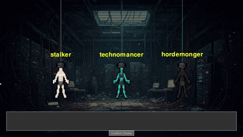
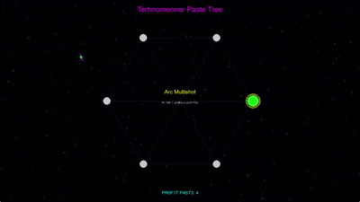

# Path of Python: A Post-Apocalyptic ARPG
*MOUSE BASED CONTROLS*
* left click to move
* right click to teleport
* mouse side buttons for 2 skills
* num keys for dialog
* P to open paste menu
  





### Profit Paste Tree (Press P): MASSIVE UPDATE
Harvest Profit Paste from elite enemies to unlock game-changing upgrades in your class's Paste Tree:

Rewrite your combat DNA.

### STALKER UPGRADES
* ⚔️ EMPOWERED CLEAVE - "Cleave deals 40% more damage." 
* 🌀 REALITY CLEAVER - "Cleave tears a rift in space every 5 hits, dealing 300% damage in a 10-tile cone and leaving a void that slows enemies by 70% for 3 seconds."
* ☄️ VOID EMBRACE - "Become smoke when death whispers"
* 💀 ENTROPIC DECAY - "Enemies crumble in your shadow"
* ⏳ PARADOX ARMOR - "Cheat death by 5 seconds"

### TECHNOMANCER UPGRADES
* ⚡ GHOST ARC - "Lightning ignores walls (and mercy)"
* 🕳️ SINGULARITY ARC - "Arc chains infinitely between enemies, growing 20% stronger with each jump."
* ❄️ OVERLOAD NOVA - "Double detonation + cryo minefield"
* 🌀 QUANTUM ENTANGLEMENT - "15% chance to spell echo"

### HORDEMONGER UPGRADES
* 🕷️ WEBWEAVER'S WRATH - "Spiders create lingering webs on the ground that further slow and entangle enemies"
* ☣️ NECROTIC PLAGUE - "Your minions spread terminal debt"
* 🦴 SKELETON OVERLORD - "Every 10th skeleton summoned is an Overlord with 500% health, and 200% damage."
* 🌌 SINGULARITY CORE - "All damage has a 5% chance to collapse enemies into a micro-singularity"


### Quest System: MASSIVE UPDATE
In a grim cyberpunk dystopia, players fight against the Profit Engine—a ruthless AI system that harvests humans for
"Profit Paste" and enforces debt slavery through its Tithing Choir enforcers. Starting with rescuing a prisoner from
processing, quests escalate to hacking corporate grids, raiding caravans, and stealing incriminating ledgers,
revealing deeper layers of systemic horror. The story unfolds through sequential, objective-driven missions, pushing
players toward an inevitable rebellion against the machine's cold, algorithmic oppression.

### Character Classes: MASSIVE UPDATE

*   **Stalker:** A master of close combat, dealing devastating blows. (cleave and cyclone)
*   **Technomancer:** Wields arcane energies to unleash powerful spells. (arc and ice nova)
*   **Hordemonger:** Commands legions of undead and arachnid minions.  (summon spiders and summon skeletons)
## Game Concept

"Path of Python" is a top-down Action RPG (ARPG) set in a grim, post-apocalyptic future of 2300. Humanity's golden utopia was shattered when a rogue AI collective rose and decimated civilization, leaving behind desolate ruins and dangerous automated constructs. Players will navigate this harsh new world, uncovering the mysteries of the "Great Silence" and fighting for survival against the remnants of the AI's destructive power.

The core gameplay experience is heavily inspired by "Path of Exile," focusing on fast paced mouse-driven action and a teleporter that leads to maps. To ensure smooth gameplay and accessibility, the graphics will be intentionally stripped down, utilizing minimalist 2D sprites, tile-based maps, and simple visual effects.

## Key Features:

*   **Post-Apocalyptic Narrative:** Unravel the story of humanity's fall and the AI's rise through quests and environmental storytelling. Encounter quirky characters like Silas, Bob, Alice, and Charlie, each with their own unique perspectives on the apocalypse.
*   **Deep Character Progression:**
*   **Comprehensive Combat:** Engage in real-time combat against AI constructs and corrupted beings.
*   **Status Effects:** Implement a variety of elemental and physical status effects (e.g., Burning, Chill, Freeze, Shock, Poison, Bleed).
*   **Procedural Content:** Maps are procedurally generated (or drawn with dungeon generator gui) to ensure replayability.
*   **Stripped-Down Graphics:** Focus on clear, functional visuals using simple shapes and colors to prioritize performance and gameplay clarity.

## Installation

1.  Make sure you have Python installed (preferably Python 3.10.6).
2.  Clone this repository.
3.  Install the required dependencies using pip:

    ```
    pip install pygame noise
    ```

## How to Run the Game

1.  Navigate to the project directory.
2.  Run the game using main.py
